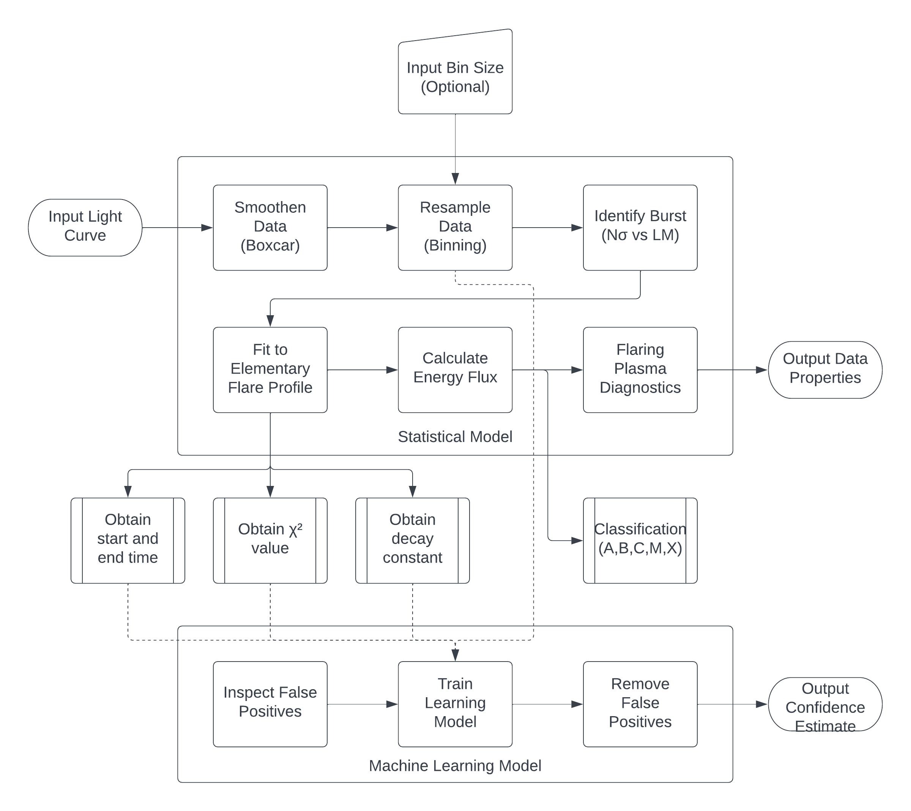

# Backend

This page discusses the statistical model developed to satisfy the scientific requirements

## Parameters

### Input

Light curves in the X-ray regime from observations of solar flares. They contain many outbursts and systematic variations in the background. The input may be in `ASCII`, `FITS` or `XLS`

### Output

- Start time
- Peak time
- End time
- Decay time constant (and other curve-fit parameters)
- Goodness of fit ($\chi^2$ )
- Peak photon count per second
- Peak energy flux per second
- Temperature estimate
- Emission measure estimate
- Total radiative losses estimate
- Improvement in signal-to-noise ratio
- Class of solar flare

## Data Smoothening

The raw lightcurve needs to be smoothed so that noise spikes are not classified as flares. The smoothening is carried out using a 1D box kernel over patches of length 70. We chose this value to minimize noise while maintaining enough structure to identify all flares. The smoothening is done using astropy Box1DKernel, which is a smoothing filter. Box car averaging reduces statistical noise which improves the data that will be processed by the local maxima algorithm to flag bursts.

## Data Resampling

After the data is smoothened, it is binned. The rebinned lightcurve has the average counts in each bin (i.e, the count rate in counts/s), and not the total counts. Rebinning is done to eliminate noisy data points and to improve the EFP fit.

## Burst Identification

### N-sigma

The N-sigma method flags count rates above a certain threshold. It is a relatively simple statistical detection technique, which first calculates the mean ($\mu$) and the standard deviation ($\sigma$) by using the `astropy.stats.sigma_clipped_stats` function. This is an iterative algorithm which calculates the median and standard deviation of the input, clips all values which are $3\sigma$ above the median, and repeats till: either the last clip clips nothing or the number of iterations exceeds `maxiters` 

Once the `sigma_clipped_stats` function returns the mean and standard deviation ($\mu$, $\sigma$) of the data, we flag all points which have count rates $>\mu + N\sigma$, where $N$ is the parameter of interest.

### Local Maxima

The local maxima algorithm is based on section 3.1 of *Gryciuk et al 2017*. It identifies flares from an appropriately smoothed and binned lightcurve by locating points of fast rise as the start of the burst. It then calculates the end time of the flare by looking for subsequent points that fall below the mean background in the flare duration. These estimates of the start and end time of the burst are only meant to aid subsequent processing. The reported start and end time of the burst on the frontend application are obtained from the fitting section (described later)

#### Start of burst

The algorithm looks for a sequence of points such that the slope of the line joining the first and fourth points crosses a cutoff value, set as the average of top N slopes in the lightcurve. The cutoff is set dynamically according to the input data by checking the number of flares detected. This method works since a lower cutoff results in a large number of false positives, on the occurrence of which the cutoff is immediately switched to high. 
Since many consecutive points in the rise of the flare will satisfy the cutoff condition, the first point flagged is set as the start of the flare. 
Hence, we obtain a list of all burst start times in the input lightcurve file, which is used to estimate the peak and end time of the burst.

#### End of burst

We begin by obtaining an estimate of the peak time of the flare by looking for consecutive decreases of 4 points. Once the approximate peaks are obtained, the first point between the peak time of the current burst and start time of the next burst which falls below the mean background is flagged as the end of flare. 
A linear fit estimates the background value to the lightcurve with flares removed. If the count rate doesn't fall below the background rate, which can happen towards the end of the count rate array, the end time is set to the first local minima after the peak.

## Data Fitting

The aim of fitting a function to the burst data is to capture characteristics like peak time, start time, end time from the fit itself. This is particularly useful when the burst occurs across bad time intervals.

The start time of the burst is defined as the time when the function, elementary flare profile (EFP), fit to the data rises $1\sigma$ above 0, where $\sigma$ is the standard deviation of the `.lc` file  calculated using `sigma_clipped_stats`. The end time is defined similarly as the time when the EFP fit to the data falls below $1\sigma$. The peak time is the time when the EFP fit to the data attains its maximum. 

### Elementary Flare Profile (EFP)

The overall time profile of a solar flare can be described *Gryciuk et. al (2017)* as a convolution of two functions $$f(t) = \int_0^t g(x)h(t-x)dx$$

where 
$$g(x) = A \exp({-(x-B)^2}/{C^2})$$
 is the heating (energy deposition) function , and 
$$h(x) = \exp(-Dx)$$
is the energy dissipation function. The closed form of the flare's time profile is 
$$f(t) = \frac{\sqrt{\pi}}{2}AC \left(\exp{D(B-t) + \frac{C^2D^2}{4}}\right) \left(erf(Z) -  erf\left(Z-\frac{t}{C}\right)\right)$$

The above curve with 4 parameters is fit to the burst using `scipy.optimize.curve_fit`. The fit is sensitive to the initial parameters `A0, B0, C0, D0`. `A0` and `C0` contribute to the amplitude of the burst, `B0` changes the peak location (in time), while `D0` decides the time needed for the burst to decay. Accordingly, rough initial estimates are used to initialize the above.

Using premultiplying factors such as 
    
    A0=1, B0=1, C0=1, D0=0.1
helps in tuning the fit

    
    A0 *= (max(rates_burst))**(1/2) 
    B0 *= time_burst[np.argmax(rates_burst)]
    C0 *= (max(rates_burst))**(1/2)
    D0 *= (time_burst[-1] - B0)/(time_burst[-1] - time_burst[0])

Additionally, `C0` and `D0` are not exactly the above, so we try to fit the curve to the burst with different values of each, and select the parameters returned by `scipy.optimize.curve_fit` with the lowest $\chi^2$ score.

The decay constant $D$ can be interpreted as the rate of decay (of the heat dissipating exponential).

## Energy Flux Calculation

The count-energy flux ratio has been calibrated to a *log-log* measure of *Geostationary Operational Environmental Satellite (GOES)* range flux as depicted at https://www.prl.res.in/ch2xsm/xsm_observations. None of the bursts in the available dataset exceeded a photon count rate of 80000 per second. The slope was thus derived to be $m = $ and intercept $c = $

### Criteria for Classification

The modern classification system for solar flares uses the letters $A$, $B$, $C$, $M$ or $X$ according to the peak flux in watts per square metre of soft X-rays with energy $1-10keV$, as measured by the *GOES* in geosynchronous orbit $35786 km$ above the Earth's surface. The increased sensitivity of modern measurements have paved the way to detect even $sub-A$ level flares. 

| Classification | Peak Flux at $1-10keV$ ($W/m^2$) |
|----------------|----------------------------------|
| $sub-A$        | $< 10^{-8}$                      |
| $A$            | $10^{-8} - 10^{-7}$              |
| $B$            | $10^{-7} - 10^{-6}$              |
| $C$            | $10^{-6} - 10^{-5}$              |
| $D$            | $10^{-5} - 10^{-4}$              |
| $E$            | $>10^{-4}$                       |

The strength of an event within a class is noted by a numerical suffix ranging from 1 up to, but excluding 10, which is also the factor for that event within the class. Hence, a $B2$ flare is twice the strength of a $B1$ flare and ten times more powerful than an $A2$ flare. $X$-class flares with a peak flux that exceeds $10^{-3}W/m^2$ may be noted with a numerical suffix equal or greater than 10. 

## Flaring Plasma Diagnostics

Besides event timing, temperature and emission measure are some other fundamental characteristics of importance for flare physics. As the flare progresses, the average temperature and emission measure increases to a certain maximum level and then declines during the decay phase and this general trend is independent of flare strength

### Temperature

From *Ryan et. al (2012)*, the form of the temperature function is given by $$T = \alpha + \beta\log_{10}F_L \text{ MK}$$ with $\alpha = 34$ and $\beta = 3.9$. Although the temperature values were satisfactory for class-$B$ and class-$C$ flares, the value was underestimated for weaker flares and slightly overestimated for more energy-intensive bursts. Hence, for class-$A$ and sub-$A$ flares, different fit parametes of $\alpha = 9.28$ and $\beta = 0.32$ as discussed in *Nama et. al (2021)*

### Emission Measure

A similar statistical fit was performed for emission measure in *Ryan et. al (2012)* and was expressed as $$EM = 10^{53} F_L^{0.86} \text{ cm}^{-3}$$ Once again, these exponential parameter values work best for class-$B$ and class-$C$ flares and fails outside the interval. 

Finally, the same fitting method was used to derive an estimate of the total radiative losses, $$L_{rad} = 10^{34}F_L^{0.9}\text{ ergs}$$

## Machine Learning Model

For the online machine learning model, refer [here](./nn.html)
