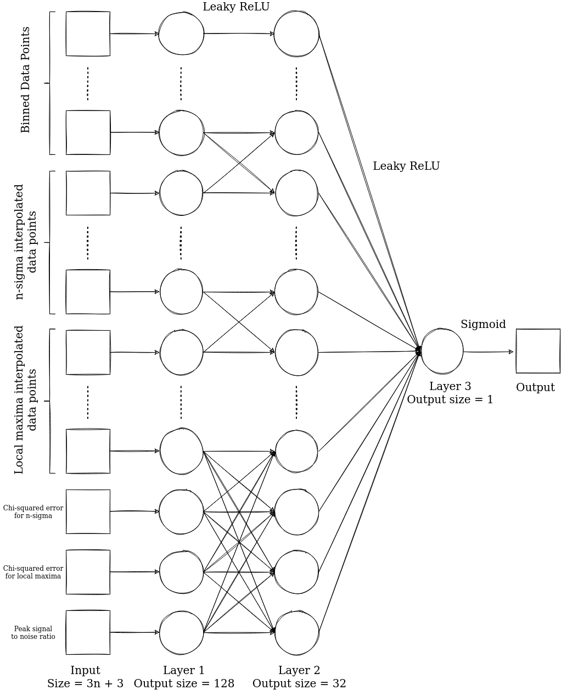

# Online Machine Learning

The idea utilised in the machine learning model is that of **Online Machine Learning**. An online machine learning model is not very different from a regular machine learning or batch learning model from an architectural perspective. It only differs in the way it is trained.

In a batch learning process, a large amount of data is fed into the machine learning model and the neural network is trained on all of the data together. On the other hand, in online learning, data is fed in smaller pieces or is *streamed* into the model as and when it arrives. 

This can be useful under two distinct circumstances:

- The system that the neural network is being trained on has limited memory capacity and therefore cannot store all of the training data together. Through online learning, the neural network can be trained on smaller datasets, one-by-one.
- The data that the neural network is supposed to be trained may continuously evolve. If one trains the neural network on the then available dataset, there is a high chance that the model becomes redundant as time passes. This is simply because it will be unaware of the newer data available. This is especially true in the case of highly erratic variables like stock prices and consumer preferences. 

In the case of solar flare data, we have a small dataset available. And even the data that is available, is unlabelled, i.e., not classified as flares vs not flares. This makes the task of training a machine learning model very difficult.

-  Using online learning, we can obtain trained data, albeit indirectly. Experts can visually inspect and determine if a light curve corresponds to a solar flare or not. The web application that is being developed allows the experts to log in and label the available light curves. This labelled data can then be used to train the machine learning model that has been created. Since we do not have an initially labelled set of data, we have no choice but to use online learning and make the model learn step by step. 
- As we keep on feeding newer data in the model, the model will be able to make use of the latest available data and **not** remain stagnant. 

### Model Architecture

The model utilizes a 3-layered neural network architecture. The architecture can be understood using the following graph: 

.

The input is a vector of length $3n + 3$. The input contains $n$ data points from binned data, n-sigma data and the local maxima data. It also contains $\ln(1 + \chi_{n\sigma}^{2})$ and $\ln(1 + \chi_{lm}^{2})$, where $\chi_{n\sigma}^{2}$ and $\chi_{lm}^{2}$ are the $\chi^{2}$ errors for the EFP fit using the n-sigma and local maxima algorithms. The last part of the input is the signal to noise ratio (SNR).

The last layer of the neural network is initialized with all weights $= 0$ and the bias $= \lambda$, which we set manually to a high value (of the order of 100). This is done so that when no training has been performed, our model returns that every light curve being input into it is detected as a true light curve and not a false positive.

The activation function between layers 1 and 2, and layers 2 and 3 is the *Leaky Rectified Linear Unit function* or LeakyReLU. LeakyReLU is defined by the following function $f(x)$:

$$
f(x) = \begin{cases}
x & x \ge 0\\
\alpha x & x < 0
\end{cases}
$$

$\alpha$ is taken to be less than 1.

It brings about non-linearity to our neural network and allows it to better approximate complicated relationships between the inputs and the output. 

The final activation function, between layers 3 and the output is a **Sigmoid** function, which converts the numerical value obtained as the output of layer 3 into a probability - the probability of the input being a solar flare in our case. The sigmoid function $S(x)$ is defined as follows:

$$
S(x) = \frac{1}{1+{e}^{-\sigma x}}
$$

The optimizer that we have utilized is **Stochastic Gradient Descent (SGD)**. There are multiple reasons why we choose SGD over other, more advanced optimizers like Adam (Adaptive Momentum Estimation) and RMSProp (Root Mean Square Propagation):

- Online training needs to be fast. SGD, although slow to converge, is a much faster method in terms of computation time.
- The training should not rely on large amounts of data. Adam and RMSProp work well when the user is performing batch training on a huge dataset with multiple input parameters. In smaller datasets, such as in the present case, either of the other optimizers can lead to *overfitting*. Also, the learning rate cannot be controlled in these algorithms directly. Using SGD, we can control the learning rate and therefore utilize the concept of *decay*.

The word decay is used in its literal sense here - the learning rate of the optimizer grows smaller as we train the model. This ensures that the model is less and less senstive to data that we introduce in the future and retains memory of what it has been taught before. If one does not make use of this, the model would simply *unlearn* whatever it has learnt before and would want to ensure that it fits the newer data that it is being trained on. With hyperparameter tuning, one can make sure that the *learning* is at the right pace - neither too fast, nor too slow. 

The learning rate $r$ of the model can be manually set by the user:

$$
r[i] = a + be^{-ci}
$$

$i$ is the number of training epochs that has been performed since the model has been deployed. It can be reset to $i = 0$ as and when needed.

The loss function is a *binary cross entropy* loss function since the problem is that of a binary classification (solar flare and not a solar flare). The binary cross entropy function can be represented in the following manner:

$$
H_{p}(q) = -\frac{1}{N}\sum_{i = 1}^{N}y_{i}\cdot\log(p(y_{i}))+(1 - y_{i})\cdot \log(1 - p(y_{i}))
$$

### Model Parameters

The model has certain internal parameters. They are listed down below: 
- $n$ = number of data points being sampled from every light curve as input to the model.
- $\sigma$ = controls the sensitivity of the final output to the output of layer 3 of the neural network.
- $\lambda$ = decides the starting probability of the light curve detection.
- $\alpha$ = decides the slope of the LeakyReLU activation function.
- $a, b, c$ = parameters controlling the learning rate of the model. 

### Future Work

There are multiple ways in which we can improve the model:

- The neural network hyperparameters can be tuned better using multiple algorithms available online. These hyperparameter tuning methods are somewhat complex and therefore have not been utilized here.
- Our current model is not *adaptive* i.e. even if it detects changes in the trend of the data being fed into it, it will be unable to actively steer the parameters towards this change in trend and therefore might take longer time to converge to the new trend. In the case of solar flares and the obtained light curves, this should not be a problem since we do not expect the solar flare activity and its representation in the light curve to change drastically with time.
- Semi-supervised learning is a relatively newer algorithm of machine learning wherein the ideas of both supervised and unsupervised learning are utilized. Herein, the model is provided with a dataset which has only a small number of labeled data. The remaining data is unlabeled. The algorithm ensures that the model learns from the labeled dataset and applies the information obtained from the labeled dataset in characterizing the unlabeled dataset. 
